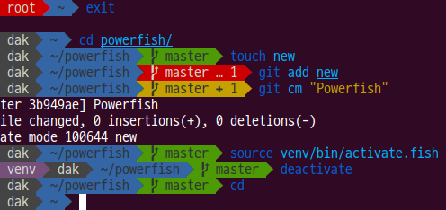

# Powerfish

Powerfish is an elegant and informative prompt for Fish inspired by [agnoster-zsh-theme](https://github.com/agnoster/agnoster-zsh-theme) and [Powerline](https://github.com/powerline/powerline). It displays the following:

* current mode (in vi mode)
* virtual environment
* failure of previous command
* number of background jobs
* elevated priviledges
* remote host
* current working directory
* git branch or detached head state
* how much git is ahead/behind remote
* number of untracked/modified/staged/conflicted/stashed files in git

The prompt only shows information relevant to the context, so it won't clutter your screen. But enough talking, a picture is worth a thousand words:



## Install

For best experience, you should use one of the [Powerline-patched fonts](https://github.com/Lokaltog/powerline-fonts).

To install Powerfish, first clone the repository:

`git clone git@gitlab.com:radek-sprta/powerfish.git`

Then copy the `fish_prompt.fish` to overwrite your current prompt.
```
mkdir -p ~/.config/fish/functions/
cp fish_prompt.fish ~/.config/fish/functions/
```

## License

Powerfish is licensed under GNU GPLv3.

## What is coming next?

Immediate goals for Powerfish are:

* better color coding of git branch
* integrate to fisherman
* support for multiple color themes
