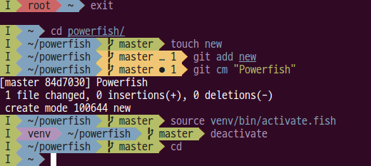

# Powerfish

Powerfish is an elegant and informative prompt for [Fish](https://github.com/fish-shell/fish-shell) inspired by [agnoster-zsh-theme](https://github.com/agnoster/agnoster-zsh-theme) and [Powerline](https://github.com/powerline/powerline). The prompt only shows information relevant to the context, so it won't clutter your screen. But enough talking, a picture is worth a thousand words:



## Features

Powerfish displays the following:

* Current Vi mode
* Flags:
    * private mode
    * failure of previous command
    * number of background jobs
* Kubernetes context
* Terraform workspace
* Vagrant status
* Python virtual environment
* Ruby version
* User:
    * Non-default user
    * Elevated priviledges
* Remote host
* Current working directory
* Git, via colors and flags:
    * Dirty or conficted working directory
    * Branch name or detached head
    * Number of commits ahead/behind remote
    * Number of untracked/modified/staged/conflicted/stashed files

And that's not all! You can choose from several different color themes - the default (on the picture), Tomorrow Night or Solarized Dark.

## Install

**Fisherman**

You can install Powerfish via [Fisherman](https://github.com/fisherman/fisherman):

`fisher radek-sprta/powerfish`

**Manual**

Alternatively, for manual install from Git, first clone the repository:

`git clone git@gitlab.com:radek-sprta/powerfish.git`

Then copy the `fish_prompt.fish` to overwrite your current prompt.
```
mkdir -p ~/.config/fish/functions/
cp fish_prompt.fish ~/.config/fish/functions/
```

For best experience, you should use one of the [Powerline-patched fonts](https://github.com/Lokaltog/powerline-fonts).

## Configuration

You can override some of the default options in your `config.fish`:

```fish
set -g DEFAULT_USER username
set -g pf_no_counters true
set -g pf_color_theme default|tomorrow-night|solarized-dark|solarized-light
```

- `set -g DEFAULT_USER username` hides the default username.
- `set -g pf_no_counters` hides the counter for git files, jobs etc.
- `set -g pf_color_theme` change the color theme to `tomorrow-night`, `solarized-dark`, `solarized-light` or back to `default`

## License

Powerfish is licensed under GNU GPLv3.
